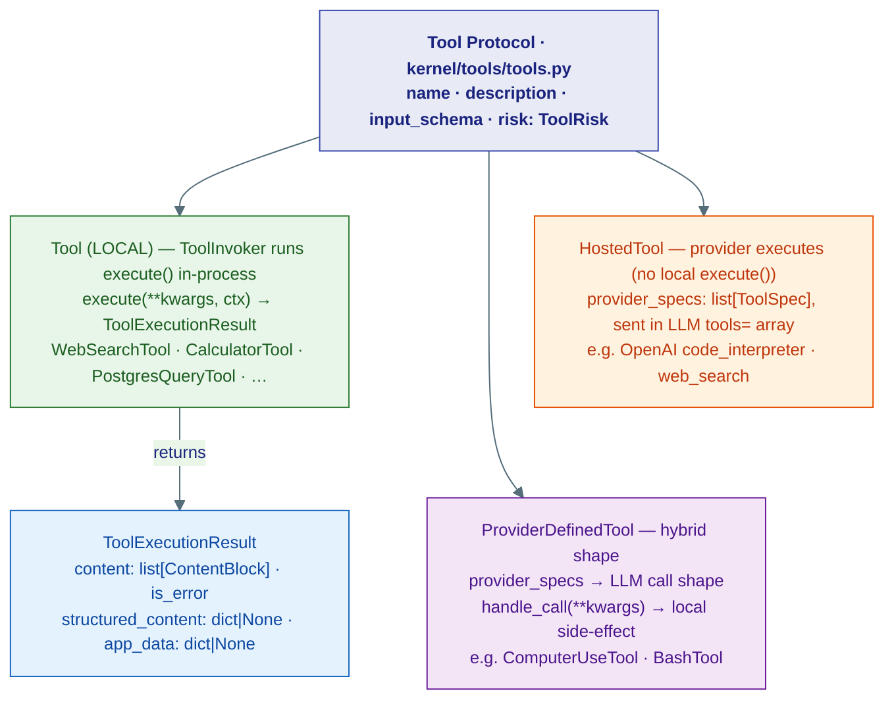
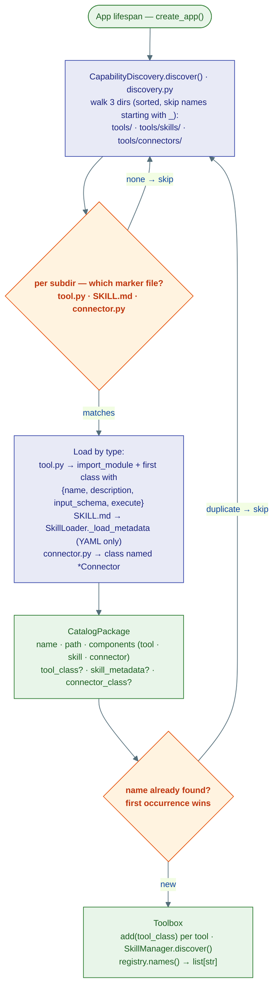

# 1 · Tools

## Three kinds of tool

The kernel defines three concrete types in `kernel/tools/tools.py`. Everything in L2 and L1 branches on this taxonomy.



| Type | Dispatch | Example |
|---|---|---|
| `Tool` (LOCAL) | `ToolInvoker` calls `execute()` in-process | `WebSearchTool`, `CalculatorTool` |
| `HostedTool` | Included in `tools=` array; provider runs it | Code execution on OpenAI |
| `ProviderDefinedTool` | LLM calls a provider-defined shape; `handle_call()` runs locally | `ComputerUseTool` |

Use `is_hosted_tool()` / `is_provider_defined_tool()` from `kernel.tools` to branch at dispatch.

## CapabilityDiscovery — auto-scan at startup

`CapabilityDiscovery` (`capabilities/tools/discovery.py`) walks three directories at boot:

- `capabilities/tools/` — tool packages (any subdirectory with `tool.py`)
- `capabilities/tools/skills/` — skill packages (any subdirectory with `SKILL.md`)
- `capabilities/tools/connectors/` — connector packages (any with `connector.py`)



First-occurrence wins — earlier directories take priority if the same package name appears in multiple locations.

## Built-in tools

| Package | Class | What it does |
|---|---|---|
| `web/search.py` | `WebSearchTool` | Tavily web search |
| `web/surfer.py` | `WebSurferTool` | Headless browser page fetch |
| `web/read_url.py` | `ReadUrlTool` | Fetch + extract text from URL |
| `web/wikipedia.py` | `WikipediaTool` | Wikipedia article lookup |
| `files/document_analyzer.py` | `DocumentAnalyzerTool` | Extract text from PDF/DOCX/etc |
| `files/invoice_extractor.py` | `InvoiceExtractorTool` | Structured invoice data extraction |
| `communication/email_sender.py` | `EmailSenderTool` | Send email via SMTP |
| `communication/http_request.py` | `HttpRequestTool` | Arbitrary HTTP requests |
| `compute/calculator.py` | `CalculatorTool` | Safe math expression evaluator |
| `database/postgres_query.py` | `PostgresQueryTool` | Run SQL on a user-configured DB |
| `ai/image_generator.py` | `ImageGeneratorTool` | Generate images via DALL-E / compatible |
| `ai/knowledge_search.py` | `KnowledgeSearchTool` | Search a `KnowledgeBase` via RAGPipeline |
| `task_manager/tool.py` | `TaskManagerTool` | Kanban board (create/update/list tasks) |
| `utils/current_time.py` | `CurrentTimeTool` | Current UTC timestamp |
| `utils/tool_search.py` | `ToolSearchTool` | Search the Toolbox by name/description |
| `code_interpreter/code_interpreter/tool.py` | `CodeInterpreterTool` | Execute Python or shell in an isolated sandbox — backend chosen by `SANDBOX_RUNTIME` (`nsjail`: Linux namespaces + cgroups on this host, the single-node default; `k8s`: one agent-sandbox pod per session; `inprocess`: no isolation, tests only) via `runtimes/factory.py::build_runtime` |
| `skills/tool.py` | `SkillTool` | Discover and activate agent skills |
| `chain/tool.py` | `ToolChainTool` | Script-driven multi-tool chaining (see page 3) |

## Writing a tool

Drop a `tool.py` in any subdirectory under `capabilities/tools/`:

```python
from substrate.kernel.tools import ToolExecutionResult
from substrate.kernel.core.content import TextBlock

class MyTool:
    name = "my_tool"
    description = "What it does — shown to the LLM"
    input_schema = {
        "type": "object",
        "properties": {"query": {"type": "string"}},
        "required": ["query"],
    }

    async def execute(self, *, ctx=None, query: str, **_) -> ToolExecutionResult:
        result = do_work(query)
        return ToolExecutionResult(content=[TextBlock(text=result)])
```

`CapabilityDiscovery` finds it automatically at next startup — no registration step needed.

### Risk annotation

Tag tools that modify state or call external APIs:

```python
from substrate.kernel.tools import ToolRisk

class DangerousTool:
    risk: ToolRisk = ToolRisk.HIGH   # SAFE | LOW | MEDIUM | HIGH | CRITICAL
    ...
```

`ToolInvoker` (L1) enforces approval gates for `HIGH` and `CRITICAL` tools before calling `execute()`.

### `ToolExecutionResult` fields

```python
@dataclass
class ToolExecutionResult:
    content: list[ContentBlock]       # TextBlock, ImageBlock, …
    is_error: bool = False
    structured_content: dict | None = None   # machine-readable output
    app_data: dict | None = None             # metadata not shown to LLM
```
