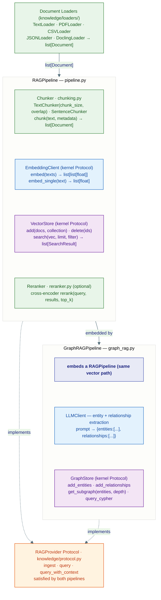
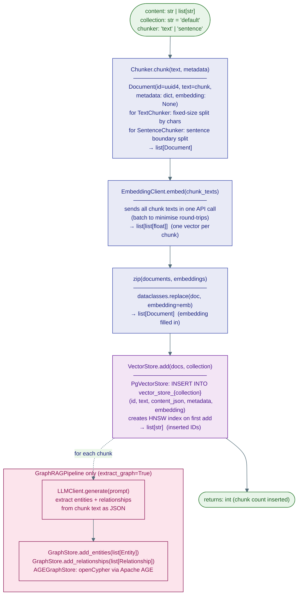
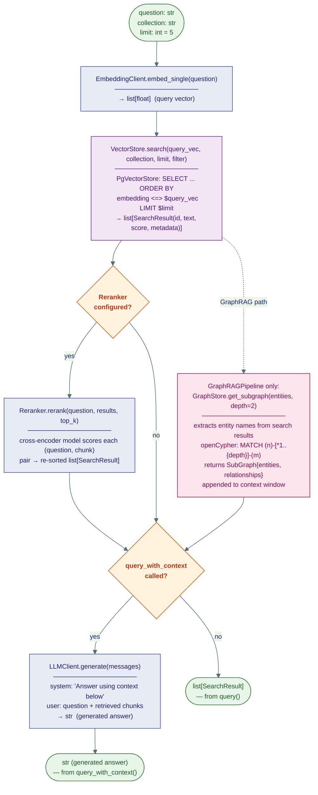

# 4 · Knowledge & RAG

The knowledge sub-package wires together embedding clients, vector stores, chunkers, and an optional knowledge graph into two high-level pipelines: `RAGPipeline` (vector similarity only) and `GraphRAGPipeline` (vector + graph traversal).

## Two pipelines



## Ingest flow



## Query flow



## `RAGPipeline` API

```python
pipeline = RAGPipeline(
    embedding_client=embed_client,   # EmbeddingClient Protocol
    vector_store=vector_store,       # VectorStore Protocol
    default_chunk_size=512,
    default_chunk_overlap=128,
)

# Ingest text
n = await pipeline.ingest("Long document …", collection="kb", chunker="text")

# Ingest pre-chunked documents (e.g. from a loader)
n = await pipeline.ingest_documents(docs, collection="kb")

# Retrieve
results: list[SearchResult] = await pipeline.query("What is X?", collection="kb", limit=5)

# Full RAG: retrieve + generate
answer: str = await pipeline.query_with_context(
    "What is X?",
    collection="kb",
    model_client=llm_client,
)
```

## `GraphRAGPipeline` API

```python
pipeline = GraphRAGPipeline(
    rag_pipeline=rag_pipeline,
    graph_store=graph_store,
    model_client=model_client,
)

# Ingest into vector store + extract entities into graph
n = await pipeline.ingest_with_graph("Document …", collection="kb", extract_graph=True)

# Query — vector results enriched with graph neighbours
results = await pipeline.query("Who works at Acme?", collection="kb")
```

## Chunkers

| Class | Strategy | Parameters |
|---|---|---|
| `TextChunker` | Fixed-size character split with overlap | `chunk_size=512`, `overlap=128` |
| `SentenceChunker` | Sentence-boundary split | `max_chunk_size` |

```python
from substrate.capabilities.knowledge.chunking import get_chunker

chunker = get_chunker("text", chunk_size=512, overlap=128)
docs = chunker.chunk("Long text …", metadata={"source": "readme.md"})
```

## Document loaders

All loaders implement the `DocumentLoader` base protocol: `async def load(path) -> list[Document]`.

| Module | Class | Formats |
|---|---|---|
| `text_loader.py` | `TextLoader` | `.txt`, `.md` |
| `pdf_loader.py` | `PDFLoader` | `.pdf` (pypdf) |
| `csv_loader.py` | `CSVLoader` | `.csv` |
| `json_loader.py` | `JSONLoader` | `.json` |
| `docling_loader.py` | `DoclingLoader` | `.pdf`, `.docx`, `.pptx`, `.html` via docling |

## `RAGProvider` Protocol

Both pipelines satisfy the `RAGProvider` protocol (`knowledge/protocol.py`):

```python
class RAGProvider(Protocol):
    async def ingest(self, content, *, collection="default", **kwargs) -> int: ...
    async def query(self, question, *, collection="default", limit=5, **kwargs) -> list[SearchResult]: ...
    async def query_with_context(self, question, *, collection="default", limit=5, **kwargs) -> str: ...
```

The `KnowledgeSearchTool` (`capabilities/tools/ai/knowledge_search.py`) accepts any `RAGProvider` — swap `RAGPipeline` for `GraphRAGPipeline` without changing the tool.

## Reranker

`capabilities/knowledge/reranker.py` provides `LLMReranker` — it uses an existing LLM client as a cross-encoder-style relevance judge (no external reranking model to download or serve) to post-process `VectorStore.search()` results before they are passed to the LLM. It retrieves top-K*3 candidates, asks the LLM to score each one's relevance to the query, and returns the top-K by score. It is optional — use it when recall quality matters more than latency (an extra LLM call per rerank).

```python
from substrate.capabilities.knowledge.reranker import LLMReranker

reranker = LLMReranker(model_client=client)
reranked = await reranker.rerank(query, results, top_k=3)
```

## Paged memory pipeline

`knowledge/page_pipeline.py` handles very long documents by splitting them into pages rather than fixed-size chunks. Use it when the document has natural page boundaries (PDFs) and you want to preserve page-level context.

## Citations & Deduplication

`capabilities/knowledge/citations.py` turns raw vector search results into grounded, numbered citations (`Citation`) for tool output and UI source chips:

- **`CitationLedger`**: Numbers passages per `(file_id or filename, page)` across multiple search calls within a turn, preventing conflicting `[1]` numbers.
- **Score Thresholding (`filter_by_score`)**: Filters candidates below `RAG_MIN_RERANK_SCORE` (default 0.1). Filtered or nameless results receive index 0 (uncitable) while preserving positional list alignment.
- **Near-Duplicate Suppression (`suppress_near_duplicates`)**: Uses `difflib.SequenceMatcher` (threshold 0.9) to discard adjacent chunk overlap windows, retaining the highest-scoring chunk.
- **Continuity-Gated Adjacency Context**: Attaches preceding/following chunks only when sentence boundaries appear cut off mid-sentence (lowercase start, unclosed punctuation). Surrounding context is surfaced explicitly rather than concatenated directly into the matched snippet.

## Multimodal Ingestion & Image Store

`capabilities/knowledge/backends/local.py` and `capabilities/knowledge/document_ingest_pipeline.py` coordinate multimodal RAG:

- **Separate Vector Stores**: Text chunks live in `vector_store` (1536d), while chart and table images live in `image_store` (2048d with `Qwen3-VL-Embedding-2B`). Tables cannot share embedding dimensions.
- **Image Offloading**: Rather than inlining ~500KB page images into vector rows, images are persisted to `file_store` (Workspace or S3), keeping only an `image_key` in metadata. This prevents DB bloat while search retrieves embeddings. At query time, `_rehydrate_image` retrieves the image bytes for candidate blocks.
- **OCR Dual-Indexation**: Extracted image blocks preserve their OCR layout text in the vector row, enabling both visual similarity search and lexical/hybrid search. Short OCR noise fragments (< 4 chars or stray punctuation) are discarded to avoid corrupting image descriptions.
- **Candidate Merging**: During retrieval, `_hybrid_candidates` pools candidates across text dense/lexical search and multimodal image search before reranking.
- **Object Key Layout**: For filesystem-backed object stores (e.g. SeaweedFS filer), keys are stored as siblings (`pdfs/{name}` and `images/{name}/p{page}-{index}.ext`) rather than prefix paths (`{name}/images/...`), avoiding leaf-file vs directory collisions.
- **HTML Table Token Ceilings**: Tables extracted as raw HTML lack punctuation delimiters, causing single chunks to potentially exceed embedding context windows (e.g. 1024 tokens). Oversized chunks and images are safely filtered with explicit loss reporting in ingest metrics.
- **Atomic Batch Ingest**: Per-file chunks and images are inserted in a single atomic `store.add()` call, preventing checkpoint desynchronization across crashes.
- **Eager Staged Ingestion**: On file upload, extraction and embedding execute in the background to a temporary `staging:{file_id}` collection. When a chat turn references the file, staged vectors are promoted into the thread collection without repeating OCR/embedding, leveraging `extracted_text` and `rag_ingested_at` as immutable caches.


