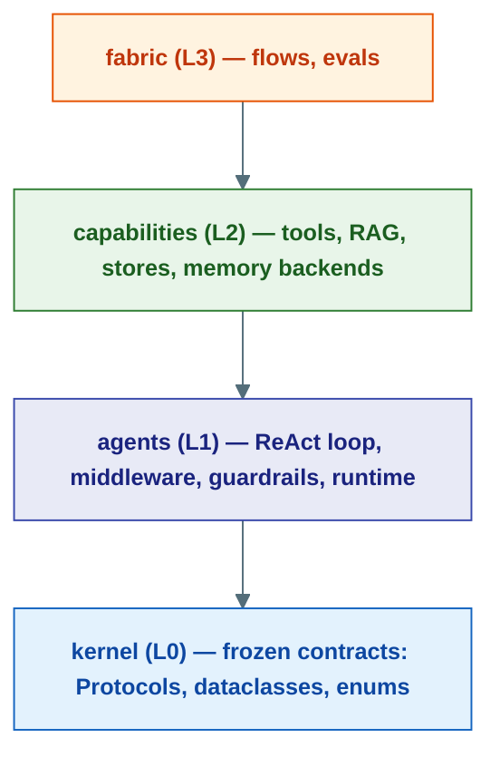

---
hide:
    - navigation
    - toc
---
# Agent Substrate

**An async-first Python framework for building production AI agents that call tools, remember across sessions, pause for human approval, survive crashes, and scale from a single process to a Kubernetes fleet — without changing your agent code.**

Most "agent" libraries help you wrap a model call in a loop. Agent Substrate is built for the part that comes after the demo: durability, supervision, governance, memory, and multi-agent orchestration — the things you need when an agent has to run unattended, handle real users, and not lose state when a worker dies.

[Understand the framework :material-arrow-right:](concepts/index.md){ .md-button .md-button--primary }
[The agent model :material-arrow-right:](concepts/agent-model.md){ .md-button }

---

## What you can build

<div class="grid cards" markdown>

-   :material-robot-happy-outline: **Conversational assistants**

    ---

    RAG-backed chatbots with streaming responses, persistent memory, and human-in-the-loop approval cards. The `substrate-ui` template deploys as a ready-made chat shell.

-   :material-sitemap-outline: **Multi-agent workflows**

    ---

    Coordinate fleets of specialised agents — a researcher hands off to an analyst hands off to a writer — with `OrchestratorAgent`, sub-agent spawning, and supervision budgets.

-   :material-cog-play-outline: **Autonomous task agents**

    ---

    Long-running agents that browse the web, run code in a sandbox, query databases, and call MCP tools — checkpointed so they resume exactly where they left off after a crash.

-   :material-file-document-multiple-outline: **Document & data pipelines**

    ---

    Extract invoices, analyse documents, ingest knowledge bases with `RAGPipeline` / `GraphRAGPipeline`, and run scheduled or webhook-triggered batch jobs.

</div>

---

## Why Agent Substrate

| Capability | What it means for you |
|---|---|
| **[Actor-model agents](concepts/agent-model.md)** | Every agent has an address (`AgentId`). You send messages to an address, the runtime delivers them. The call site is identical whether the agent runs in-process, on another node, or in a pod. |
| **[Durable runtime](concepts/durability.md)** | Every step is journaled to an event log. If a worker crashes mid-run, another worker replays from the log with at-most-once effect guarantees — no double charges, no lost work. |
| **[Human-in-the-loop](concepts/human-in-the-loop.md)** | Pause an agent on a risky tool call, surface an approval card to a human, and resume hours later. The wait survives a restart. |
| **[Tools + MCP](concepts/tools.md)** | JSON-schema-validated tools with risk tiers and approval gating. Connect any [MCP](https://modelcontextprotocol.io) server and its tools appear to the agent automatically. |
| **[Memory that scales](concepts/memory.md)** | Pluggable history providers plus advanced [vector](concepts/vector-memory.md), [graph](concepts/graph-memory.md), and [paged](concepts/paged-memory.md) strategies, so agents recall context beyond the window. |
| **[Governance & guardrails](concepts/guardrails.md)** | Spawn budgets, token caps, content guardrails, and middleware pipelines enforce safety and cost limits at the runtime level. |
| [**One codebase, two deploy modes**](#how-its-built) | Run as a single FastAPI monolith for development, or split into 12 independent microservices for production — the same agent package powers both. |

---

## Your first agent

```python
import asyncio
from substrate.config import settings
from substrate.agents import ReActAgent, Runtime
from substrate.agents.context import ContextConfig, InMemoryHistoryProvider
from substrate.integrations.llm import LLMFactory
from substrate.capabilities.tools import CalculatorTool


async def main() -> None:
    # 1. Build an LLM client (provider auto-detected from the model name)
    model = LLMFactory(settings.CHAT_MODEL, settings.OPENAI_API_KEY).build()

    # 2. Construct an agent with tools and memory
    agent = ReActAgent(
        "helper",
        model=model,
        tools=[CalculatorTool()],
        context=ContextConfig(InMemoryHistoryProvider()),
        system_instructions="You are a helpful assistant.",
    )

    # 3. Start the runtime, register the agent, talk to it
    async with Runtime() as rt:
        await rt.register(agent)

        from substrate.console import Console
        console = Console(agent, runtime=rt)
        await console.interactive(stream=True)


if __name__ == "__main__":
    asyncio.run(main())
```

The shape never changes. Adding tools, guardrails, streaming, HITL approvals, or swapping the in-process runtime for a Postgres-backed durable one is all configuration — the call site stays the same. See [The Agent Model](concepts/agent-model.md) for why.

---

## Installation

=== "uv (recommended)"

    ```bash
    git clone https://github.com/Ravikumarchavva/agent-substrate.git
    cd agent-substrate
    uv sync
    ```

=== "with extras"

    ```bash
    uv sync --group notebooks   # Jupyter notebook examples
    uv sync --group browser     # Browser automation (WebSurferTool)
    uv sync --group storage     # S3 / object storage
    ```

Then start the infrastructure and run your agent:

```bash
make infra-up        # Postgres, Redis, MCP server, observability
uv run substrate start --host 0.0.0.0 --foreground   # Monolith on port 8001
```

---

## How it's built

Agent Substrate is organised into **four strictly-layered modules** plus three orthogonal concerns. Each layer imports only from the layers below it — enforced in CI by `uv run lint-imports`.



`integrations` (LLM providers, MCP, connectors), `infrastructure` (Postgres, Redis, SeaweedFS, durable runtime), and `serving` (the monolith + 12 microservices) sit orthogonal to the stack — they implement kernel Protocols and wire everything together at startup.

**The Capability Map** — the platform organized by *concern* rather than by code layer: context (the RAM tier), memory (short-term + long-term with pluggable backends), storage (the disk tier), guardrails, governance, evals, observability, and tools. Every item names a real, shipped class.

[Open the Capability Map :material-arrow-right:](capability-map.md){ .md-button .md-button--primary }

**The Kernel Board** — the contract-level view of the frozen kernel. Every protocol is drawn as a socket around the `Agent[CtxT]` CPU; click a socket for its contract and the real implementations that plug into it — where several exist, you can swap which one is seated.

<iframe id="kboard-frame" src="kernel-board.html" title="Kernel Board"
  style="width:100%;height:520px;border:1px solid var(--md-default-fg-color--lightest);border-radius:8px;display:block;"
  loading="lazy"></iframe>
<script>
  window.addEventListener("message", (e) => {
    if (e.data && typeof e.data.kboardHeight === "number") {
      const f = document.getElementById("kboard-frame");
      if (f) f.style.height = e.data.kboardHeight + "px";
    }
  });
</script>

[Open full page :material-arrow-right:](kernel-board.html){ .md-button }

The kernel board shows *what's available* — for *assembling* a working agent from those pieces, the [Agent Builder](agent-builder.html) generates real, accurate Python from the actual `ReActAgent` constructor signatures: pick a memory backend, tools, guardrails, and budgets, and copy out working code.

[Open the Agent Builder :material-arrow-right:](agent-builder.html){ .md-button }

---

## Start here

<div class="grid cards" markdown>

-   :material-recycle-variant: **The Agent Model**

    ---

    Agents as addresses, the three identities, and the ReAct loop. The foundation everything builds on.

    [:octicons-arrow-right-24: Read it](concepts/agent-model.md)

-   :material-database-clock-outline: **Durability**

    ---

    Event logs, journaling, at-most-once effects, and crash recovery.

    [:octicons-arrow-right-24: Read it](concepts/durability.md)

-   :material-account-check-outline: **Human-in-the-Loop**

    ---

    Pause on risky tool calls, approve, and resume — even across restarts.

    [:octicons-arrow-right-24: Read it](concepts/human-in-the-loop.md)

-   :material-brain: **Memory & Context**

    ---

    History providers, compaction, and the vector/graph/paged strategies.

    [:octicons-arrow-right-24: Read it](concepts/memory.md)

</div>

[See all concepts :material-arrow-right:](concepts/index.md)

---

## Examples

The [`examples/`](https://github.com/Ravikumarchavva/agent-substrate/tree/main/examples) folder has runnable notebooks covering foundations, memory, MCP tools, safety, the durable runtime, and observability — from a single-tool agent to a Kubernetes deployment.
